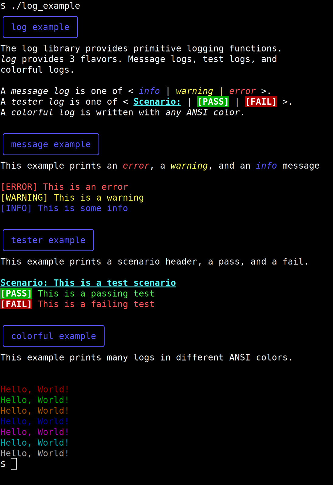

# log 
 [](https://github.com/Jacob-C-Smith/log/actions/workflows/make.yml)

 *Log messages, tests, and ANSI colored text*

 > 0 [Try it](#try-it)
 >
 > 1 [Download](#download)
 >
 > 2 [Build](#build)
 >
 >> 2.1 [Build > Targets](#build--targets)
 >
 > 3 [Example](#example)
 >
 >> 3.1 [Example > Output](#example--output)
 >
 > 4 [Test](#test)
 >
 > 5 [Definitions](#definitions)
 >
 >> 5.1 [Definitions > Enumerations](#definitions--enumerations)
 >>
 >> 5.2 [Definitions > Functions](#definitions--functions)
 >>
 >> 5.3 [Definitions > Macros](#definitions--macros)
 >
 > 6 [Manual](#manual)
 >
 >> 6.1 [Manual > Message](#manual--message)
 >>
 >> 6.2 [Manual > Tester](#manual--tester)
 >>
 >> 6.3 [Manual > Colorful](#manual--colorful)
 >
 > 7 [Commentary](#commentary)

 ## Try it
  [](https://codespaces.new/Jacob-C-Smith/log?quickstart=1)

  Wait for a few moments, then click the play button on the bottom of the window. This will run the example program.

 ## Download
  To download log, execute the following command
  ```bash
  $ git clone https://github.com/Jacob-C-Smith/log
  $ cd log
  ```

 ## Build
  To build log, execute the following commands in repository directory
  ```bash
  $ make
  ```

  This will build the example program and dynamic / shared libraries
  ### Build > Targets
   | name                   | description                         | output                                      |
   |------------------------|-------------------------------------|---------------------------------------------|
   | **all**                | Make everything                     | *N/A*                                       |
   | **clean**              | Clean everything                    | *N/A*                                       |
   | **log**                | Build the log library shared object | ```lib/liblog.so```                         |
   | **log_example**        | Build the log library example       | ```lib/liblog.so``` ```build/log_example``` |
   | **log_example_run**    | Run the log library example         | ```lib/liblog.so``` ```build/log_example``` |
 
 ## Example
  To run the example program, execute this command
  ```
  $ ./build/log_example
  ```

  ### Example > Output
   
 
  [Source](main.c)

 ## Test 
  ``` [None] ```
 
 ## Definitions
  ### Definitions > Enumerations 
   ```c 
   enum log_color_e
   {
       black   = 30,
       red     = 31,
       green   = 32,
       yellow  = 33,
       blue    = 34,
       magenta = 35,
       cyan    = 36,
       gray    = 37,
   };
   ```

  ### Definitions > Functions
   ```c 
   // Initializer
   void log_init ( void ) __attribute__((constructor));
   
   // State
   int log_update ( const char *const path, bool ansi_color );
   
   // Messages
   int log_error   ( const char *const format, ... );
   int log_warning ( const char *const format, ... );
   int log_info    ( const char *const format, ... );
   
   // Tests
   int log_scenario ( const char *const format, ... );
   int log_pass     ( const char *const format, ... );
   int log_fail     ( const char *const format, ... );
   
   // Colorful
   int log_colorful ( enum log_color_e color, const char *const format, ... );
   
   // Cleanup
   void log_exit ( void ) __attribute__((destructor));
   ```

  ### Definitions > Macros
   Macros change log features at compile time.

   | name                        | description                                           | 
   |-----------------------------|-------------------------------------------------------| 
   | ```LOG_BUILD_NO_MESSAGES``` | Build the log library without the message functions.  | 
   | ```LOG_BUILD_NO_TESTER```   | Build the log library without the tester functions.   | 
   | ```LOG_BUILD_NO_COLORFUL``` | Build the log library without the colorful functions. | 

 ## Manual
  The log library provides 3 flavors of logging functions and redirectable output. The logging functions utilize the ANSI terminal, although there is an option to disable this.

  ```c
  /** !
   * This gets called at runtime before main. 
   * By default, log to standard out with ANSI color coding 
   * 
   * @return void
   */
  void log_init ( void );
  
  /** !
   * Update the log file and color coding flag
   *
   * @param path       path to the log file if not null pointer else log to standard out
   * @param ansi_color color coded logs if true else plain
   *
   * @return 1 on success, 0 on error
   */
  int log_update ( const char *const path, bool ansi_color ); 
  
  /** !
   * This gets called after main
   * 
   * @param void
   * 
   * @return void
   */
  void log_exit ( void ) __attribute__((destructor));
  ```

  ### Manual > Messages
   *These functions are for reporting about software at runtime.*

   ```c
   /** !
    * Log an error
    *
    * @param format printf format parameter
    * @param ...    Additional arguments
    *
    * @return 1 on success, 0 on error
    */
   int log_error ( const char *const format, ... );
   
   /** !
    * Log a warning
    *
    * @param format printf format parameter
    * @param ...    Additional arguments
    *
    * @return 1 on success, 0 on error
    */
   int log_warning ( const char *const format, ... );
   
   /** !
    * Log some information
    *
    * @param format printf format parameter
    * @param ...    Additional arguments
    *
    * @return 1 on success, 0 on error
    */
   int log_info ( const char *const format, ... );
   ```
  ### Manual > Tests
   *These functions are for reporting about tests.*

   ```c
   /** !
    * Log a passing test
    *
    * @param format printf format parameter
    * @param ...    Additional arguments
    *
    * @return 1 on success, 0 on error
    */
   int log_pass ( const char *const format, ... );
   
   /** !
    * Log a failing test
    *
    * @param format printf format parameter
    * @param ...    Additional arguments
    *
    * @return 1 on success, 0 on error
    */
   int log_fail ( const char *const format, ... );
   
   /** !
    * Log a test scenario
    *
    * @param format printf format parameter
    * @param ...    Additional arguments
    *
    * @return 1 on success, 0 on error
    */
   int log_scenario ( const char *const format, ... );
   ```

  ### Manual > Colorful
   *This function is for anything not covered by the previous sections.*

   ```c
   /** !
    * Log with user defined colors
    *
    * @param format printf format parameter
    * @param ...    Additional arguments
    *
    * @return 1 on success, 0 on error
    */
   int log_colorful ( enum log_color_e color, const char *const format, ... );
   ```
 ## Commentary
  I have very little to say about this project, despite the fact it is used in all of my other projects. It's just kind of there.
  
  ~ Jake
 