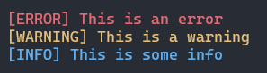

# log   
[](https://github.com/Jacob-C-Smith/log/actions/workflows/cmake.yml)

 Log errors, warnings, and information with pretty printing
  
  
 > 0 [Try it](#try-it)
 >
 > 1 [Download](#download)
 >
 > 2 [Build](#build)
 >
 > 3 [Example](#example)
 >
 >> 3.1 [Example output](#example-output)
 >
 > 4 [Definitions](#definitions)
 >
 >> 4.1 [Function definitions](#function-definitions)

## Try it
[](https://codespaces.new/Jacob-C-Smith/log?quickstart=1)

Wait for a few moments, then click the play button on the bottom of the window. This will run the example program.

 ## Download
 To download log, execute the following command
 ```bash
 $ git clone https://github.com/Jacob-C-Smith/log
 ```
 ## Build
 To build on UNIX like machines, execute the following commands in the same directory
 ```bash
 $ cd log
 $ cmake .
 $ make
 ```
  This will build the example program, the tester program, and dynamic / shared libraries

  To build log for Windows machines, open the base directory in Visual Studio, and build your desired target(s)
 ## Example
 To run the example program, execute this command
 ```
 $ ./log_example
 ```
 ### Example output
 
 
 
 [Source](main.c)
 ## Definitions
 ### Function definitions
 ```c 
 // Initializer
 int log_init ( const char *const path );

 // Debug logging
 int log_error   ( const char *const format, ... );
 int log_warning ( const char *const format, ... );
 int log_info    ( const char *const format, ... );
 ```

